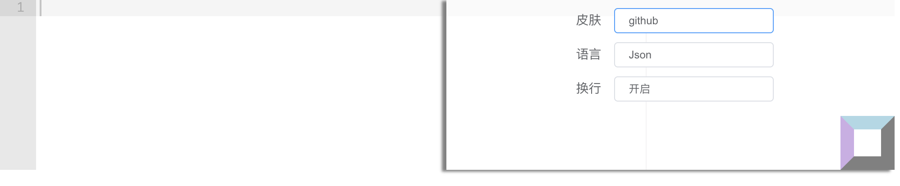

# ace-editor-vue

> Ace editor for vue2



## Installation

```
npm install ace-editor-vue
```

## Usage

```vue
<template>
  <div>
    <ace-editor v-model="value"></ace-editor>
    <p>{{value}}</p>
  </div>
</template>

<script>
import AceEditor from 'ace-editor-vue';
export default {
  name: 'HelloWorld',
  components: {AceEditor},
  data()  {
    return {
      value: ""
    }
  }
}
</script>
```

## License
MIT